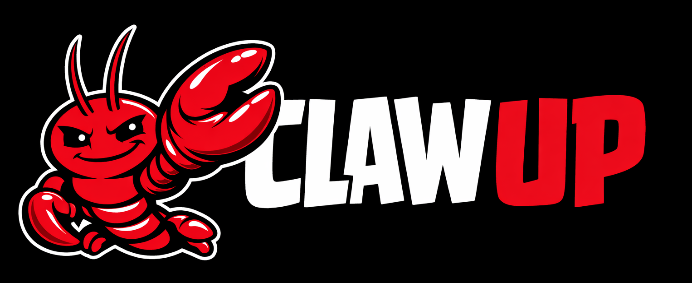

  

<h1 align="center">Claw Up</h1>

  <strong>The no-drama Windows installer for OpenClaw.</strong>

  From first download to first launch, Claw Up is built to make OpenClaw feel
  fast, simple, and almost frictionless.

  
  
  

  
  
  

---

> Download. Run. Launch. That is the whole point.

## Get Started

Download the latest Windows build from the
[Releases page](https://github.com/Adam-Jin/claw-up/releases).

How to use it:

1. Download the `.exe` installer.
2. Double-click it and complete the installation.
3. Open OpenClaw and configure your LLM API key.
4. Start using it.

## Why Claw Up Feels Different

| Instant Onboarding | Smooth Setup Energy | Release-Ready Delivery |
| --- | --- | --- |
| Cuts through the usual setup drag and gets users moving fast. | Makes the Windows path feel cleaner, friendlier, and less technical. | Ships polished `.exe` builds built for real downloads, not just demos. |

## What It Tries To Do

Claw Up exists to make OpenClaw feel easy before it even opens.

No intimidating setup maze. No unnecessary environment digging. No momentum-killing first impression.

Just a sharper path from curiosity to running software.

## First Launch, Upgraded

- faster onboarding for Windows users
- less hesitation between download and action
- a cleaner handoff into the OpenClaw experience
- the kind of installer flow people actually want to recommend
